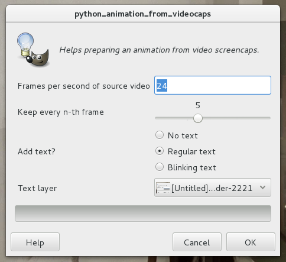

# gimp-memetools

Collection of GIM plugins that helps with putting texts on photos,
and making animated gifs from videos.


## Installation

Download [text_border.py](https://raw.githubusercontent.com/rbreu/gimp-memetools/master/text_border.py)
and/or [animation_from_videocaps.py](https://raw.githubusercontent.com/rbreu/gimp-memetools/master/animation_from_videocaps.py)
and save them in your plug-ins folder.

On Linux (depending on distro):  `~/.gimp-2.8/plug-ins/`

On Mac: `$HOME/Library/Application Support/Gimp/2.8/plug-ins/`

On Windows: Find your GIMP installation folder (commonly in `Program
Files`), then `lib\gimp\2.8\plug-ins\`

On Linux and Mac, make sure to give the files executable rights:

```
$ chmod +x /path/to/text_border.py
$ chmod +x /path/to/animation_from_videocaps.py
```

**Then restart GIMP**. You will find the text border plugin under
*"Layer -> Add text border..."* and the animation plugin under
*Filters -> Animation -> From video screencaps"*.


## Using text_border

Add text to your image. Then, with the text layer selected, go to
*"Layer -> Add text border..."*. You will be asked to select the border
thickness and border colour.


Example output:


Note that this plugin transforms the text into a regular layer, which
means that you won't be able to edit the text afterwards.


## Using animation_from_videocaps

This plugin helps turning a video scene into an animated gif. You will
need to have your scene saved as individual screencaps. Some video
players allow you to take screencaps or ranges of screencaps with a
keystroke, those are extremely helpful.

When you have your screencaps, open GIMP, go to *"File -> Open as
Layers"* and select all the screencaps you want to have in the
animation. Make sure you don't have any other GIMP files open when you
do this.

*Optional*: If you want to add text or similar stuff to your gif, add
it now and make sure it stays on its own layer. The text_border plugin
might be useful for this. ;)

Save your image, because the plugin doesn't have a convenient undo operation.

Now go to *"Filters -> Animation -> From video screencaps"*.



The first option asks you for the frame rate of the video the
screencaps came from. This information is important for determining
the correct speed for the resulting gif. Most regular videos have a
frame rate of 24 or 25 frames per second. The difference between 24
and 25 doesn't really matter for gifs, so you are probably fine with
the default.

The second option is about reducing the number of frames in your
gif. You usually don't want to keep all frames because the resulting
file size would be too big. The bigger the number you choose here, the
smaller your file size but the jerkier the movement. 4 is a good place to start.

If you haven't added any text in the step above, pick the "No text"
option and ignore the Text Layer dropdown. If you *have* added text,
choose between "Regular text" (displayed on every frame) and "Blinking
text" (displayed on every other frame), then select the layer that has
the text from the "Text Layer" dropdown.

After hitting "OK", your image is now ready for gif export. However,
you might want to resize it first. Aim for something below a width of
500 pixels.

If you are ready for the gif export, go to *"File -> Export as..."*
and choose a file name that ends in `.gif`.


Make sure that the option *As Animation* is checked. Then make sure that
the options "Use delay entered above for all frames" and "Use disposal
entered above for all frames" are **not** checked since that would
override the frame rate calculations the plugin did.

And now you're done!


### Additional info

Before exporting the gif, you can try
*"Filters -> Animation -> Optimize (for GIF)"* to help reduce the file
size.

For more involved animating, editing and preview options, look into GIMP-GAP
(GIMP Animation Package).